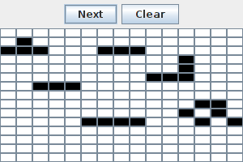

#Game of life graphical

Inventing usin the Java graphical libraries to play the [Conway's game of life](http://en.wikipedia.org/wiki/Conway%27s_Game_of_Life). Compile and run for a grid of size 15X15.
```bash
javac game/GameOfLife.java
java game.GameOfLife 15 15 # 15 rows, 15 cols  
```
